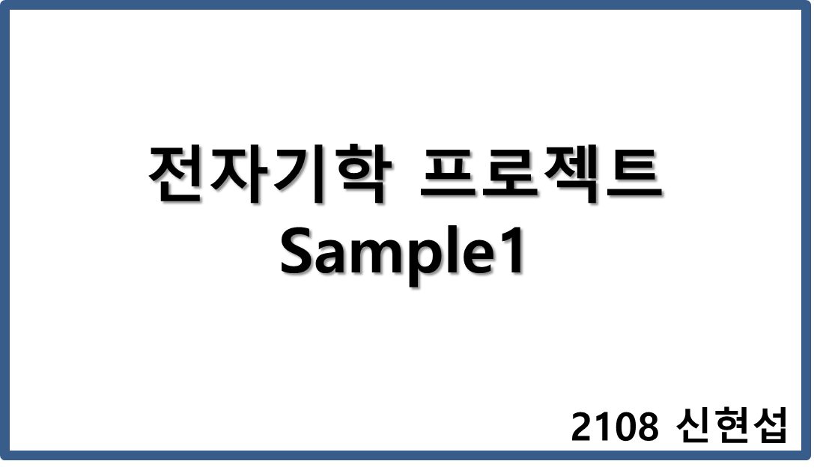
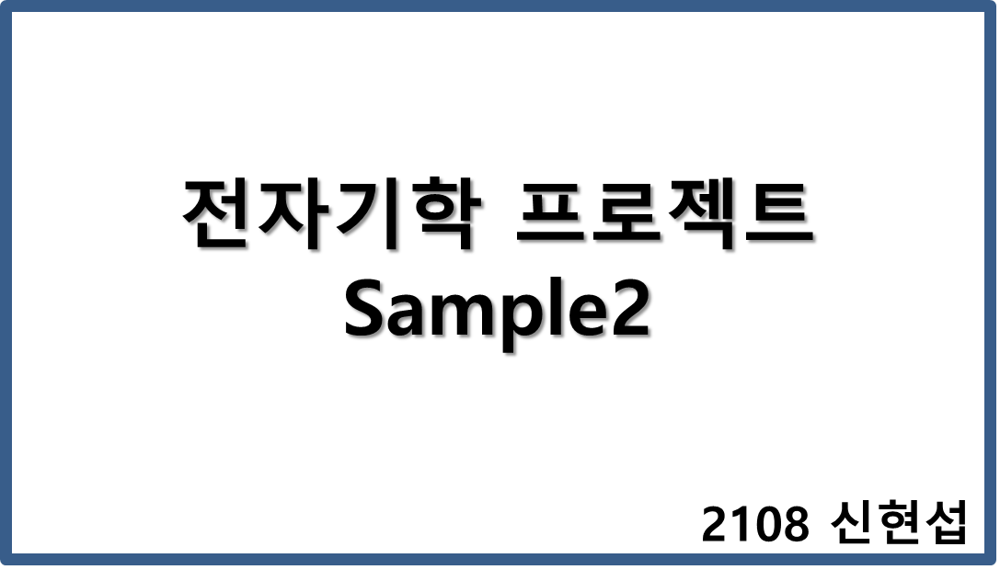

# ◉ Electromagnetic Project

전자기학 수업을 듣고 응용 프로젝트를 진행하였습니다.

### ✔ 프로젝트 개요

본 프로젝트는 30X30 평면에 전하를 배치하고 그 안에서의 전기력선과 전하의 움직임을 구현하는 것을 목적으로 한다.

### ✔ 용어 정리

- LEF(Lines of Elctric Force): 전기력선
- EF(Electric Force): 전기력
- Charge: 전하

### ✔ Sample Video

- 검은색 화살표: 전하의 속도벡터
- 보라색 화살표: 전하의 알짜힘 벡터
- 전기력선끼리 만나지 않음 주의!
- 전기력선의 밀도와 힘벡터의 크기 연관시켜보기!

### ✔ 탐구의 확장 가능성

- 등전위선을 같이 그려넣어 전기력선과 수직함을 보임
- 3차원으로 확장하여 전기력선과 전하의 움직임을 표현
